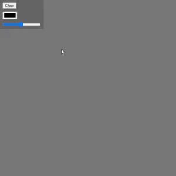

# ASP.NET-P5.JS
Данный проект - это мой первый проект, который построен на платформе ASP.NET.
В проекте используется javaScript библиотека P5JS. 
>P5.JS — это библиотека JavaScript для создания интерактивных визуализаций с помощью кода! P5.JS бесплатен и имеет открытый исходный код.
P5.JS черпает вдохновение, мудрость и руководство от своего предшественника Processing . Однако это новая интерпретация, а не эмуляция или порт. 

## Примеры графических элементов из проекта

- Простейшая "рисовалка"    

- Чуть более усложнённый вариант рисовалки с возможностью изменять цвет и толщину линий    

- Визуализация фрактала с названием "ковёр Серпинского" и его масштабирование    

- Симуляция "физического" поведения шариков (придание импульса, гравитация, отскок от поверхностей)    

